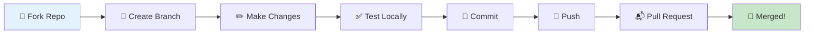

<div align="center">

```
██████╗  █████╗ ███╗   ██╗██╗  ██╗██╗███████╗██╗   ██╗
██╔══██╗██╔══██╗████╗  ██║██║ ██╔╝██║██╔════╝╚██╗ ██╔╝
██████╔╝███████║██╔██╗ ██║█████╔╝ ██║█████╗   ╚████╔╝ 
██╔══██╗██╔══██║██║╚██╗██║██╔═██╗ ██║██╔══╝    ╚██╔╝  
██║  ██║██║  ██║██║ ╚████║██║  ██╗██║██║        ██║   
╚═╝  ╚═╝╚═╝  ╚═╝╚═╝  ╚═══╝╚═╝  ╚═╝╚═╝╚═╝        ╚═╝   
                                                        
 █████╗ ███████╗███████╗██╗███████╗████████╗          
██╔══██╗██╔════╝██╔════╝██║██╔════╝╚══██╔══╝          
███████║███████╗███████╗██║███████╗   ██║             
██╔══██║╚════██║╚════██║██║╚════██║   ██║             
██║  ██║███████║███████║██║███████║   ██║             
╚═╝  ╚═╝╚══════╝╚══════╝╚═╝╚══════╝   ╚═╝             
```

### 🎯 **Your Voice. Your Browser. Your Smart Home. One Command.**


---

**Transform your voice into browser automation and smart home control**  
**Built with safety-first architecture • Powered by Tuya AI • 100% Open Source**

[🚀 Quick Start](#-quick-start-30-minutes) •
[📖 Documentation](docs/) •
[🏗️ Architecture](#-architecture) •
[🎬 Demo](#-demo)

</div>

---

## 🌟 **What Makes It Special**

<table>
<tr>
<td width="33%" align="center">

### 🌐 **Browser Magic**
**Voice → Action**

```
"Check my Gmail"
↓
🔒 Safety Check
↓
✅ You Approve
↓
🌐 Browser Opens
↓
📊 "5 Unread Emails"
```

**100% Safe!**  
Never executes without permission

</td>
<td width="33%" align="center">

### 🏠 **Smart Home**
**Voice → Instant**

```
"Turn on lights"
↓
⚡ Instant Execution
↓
💡 Lights On
↓
✅ "Done!"
```

**Lightning Fast!**  
No confirmation needed

</td>
<td width="33%" align="center">

### 💬 **AI Chat**
**Voice → Answer**

```
"What's 2+2?"
↓
🧠 AI Thinks
↓
💭 "It's 4"
↓
🔊 Voice Response
```

**Contextual!**  
Remembers conversation

</td>
</tr>
</table>

---

## ✨ **Features That WOW**

<div align="center">

| Feature | Description | Status |
|:-------:|:-----------|:------:|
| 🎤 | **Voice Control** - Natural language commands via SmartLife app | ✅ |
| 🔒 | **Safety First** - Explicit confirmation for ALL browser actions | ✅ |
| 🌐 | **Browser Automation** - Gmail, YouTube, Google Search, any site! | ✅ |
| 💡 | **Smart Home** - Control lights, AC, locks, any Tuya device | ✅ |
| 🧠 | **Conversational AI** - Chat with memory and context | ✅ |
| 👥 | **Multi-User** - Google OAuth authentication | ✅ |
| ☁️ | **Cloud Native** - Always-on Vercel + Supabase | ✅ |
| 💰 | **100% FREE** - Zero cost deployment | ✅ |
| 🔓 | **Open Source** - MIT License, all code included | ✅ |

</div>

---

## 🎬 **See It In Action**

<div align="center">

### 🌐 Browser Automation Flow

```mermaid
graph LR
    A[👤 You<br/>"Check Gmail"] --> B[🧠 AI Plans<br/>Browser Task]
    B --> C[🔊 AI Asks<br/>"Proceed?"]
    C -->|You: "Yes"| D[🌐 Browser Opens]
    C -->|You: "No"| E[❌ Cancelled]
    D --> F[📊 Result<br/>"5 Unread"]
    F --> G[🔊 AI Speaks<br/>Result]
    
    style A fill:#e1f5ff,stroke:#01579b,stroke-width:3px
    style C fill:#fff3e0,stroke:#e65100,stroke-width:3px
    style D fill:#e8f5e9,stroke:#2e7d32,stroke-width:3px
    style E fill:#ffebee,stroke:#c62828,stroke-width:3px
    style G fill:#f3e5f5,stroke:#4a148c,stroke-width:3px
```

### 🏠 Smart Home Flow

```mermaid
graph LR
    A[👤 You<br/>"Turn on lights"] --> B[🧠 AI<br/>Recognizes]
    B --> C[⚡ Instant<br/>Execution]
    C --> D[💡 Lights<br/>Turn On]
    D --> E[🔊 AI Confirms<br/>"Done!"]
    
    style A fill:#e1f5ff,stroke:#01579b,stroke-width:3px
    style C fill:#fff3e0,stroke:#ff6f00,stroke-width:3px
    style D fill:#e8f5e9,stroke:#2e7d32,stroke-width:3px
    style E fill:#f3e5f5,stroke:#4a148c,stroke-width:3px
```

</div>

---

## 🏗️ **Architecture**

<div align="center">

```
┌─────────────────────────────────────────────────────────┐
│                  🎤 SMARTLIFE APP                       │
│              "Your Voice Commands Here"                 │
└────────────────────┬────────────────────────────────────┘
                     │
                     ↓
┏━━━━━━━━━━━━━━━━━━━━━━━━━━━━━━━━━━━━━━━━━━━━━━━━━━━━━━━┓
┃          ☁️  TUYA AI WORKFLOW (Cloud)                  ┃
┃  ┌──────────────┬──────────────┬──────────────┐        ┃
┃  │ 🧠 Intent    │ 🌐 Browser   │ 🏠 IoT       │        ┃
┃  │ Recognition  │ Planner      │ Controller   │        ┃
┃  └──────────────┴──────────────┴──────────────┘        ┃
┗━━━━━━━━━━━━━━━━━━━┳━━━━━━━━━━━┳━━━━━━━━━━━━━━━━━━━━━━┛
                     │           │
        ┌────────────┴───┐   ┌───┴────────────┐
        ↓                ↓   ↓                ↓
┌────────────────┐ ┌────────────────┐ ┌────────────────┐
│ 🐍 Browser MCP │ │ 🐍 Device MCP  │ │ 💬 Chat        │
│ (Your PC)      │ │ (Your PC)      │ │ Direct Response│
└───────┬────────┘ └────────┬───────┘ └────────────────┘
        │                   │
        ↓                   ↓
┌────────────────┐ ┌────────────────┐
│ 🚀 Vercel      │ │ 🔌 Tuya API    │
│ Cloud Bridge   │ │ Smart Devices  │
└───────┬────────┘ └────────────────┘
        │
        ↓
┌────────────────┐
│ 🧩 Chrome Ext  │
│ Your Browser   │
└────────────────┘
```

</div>

<div align="center">

**🎯 Design Philosophy:** *Local MCP Servers + Cloud Bridge = Zero Cost + Maximum Control*

</div>

---

## 🚀 **Quick Start (30 Minutes)**

<div align="center">

### **🎯 4 Simple Steps to Voice-Controlled Everything**

</div>

<table>
<tr>
<td width="25%" align="center">

### **1️⃣**
### ☁️ **Cloud**

```bash
Deploy Supabase
↓
Deploy Vercel
↓
Set Env Vars
```

⏱️ **10 mins**

</td>
<td width="25%" align="center">

### **2️⃣**
### 🧩 **Extension**

```bash
pnpm install
↓
pnpm build
↓
Load in Chrome
```

⏱️ **5 mins**

</td>
<td width="25%" align="center">

### **3️⃣**
### 🐍 **MCPs**

```bash
Install SDK
↓
Configure .env
↓
Run Servers
```

⏱️ **10 mins**

</td>
<td width="25%" align="center">

### **4️⃣**
### 🎤 **Test**

```bash
Say Command
↓
Confirm
↓
Watch Magic!
```

⏱️ **5 mins**

</td>
</tr>
</table>

<div align="center">

**📖 [Detailed Guide →](docs/deployment/00-QUICK-START.md)**

</div>

---

## 💎 **Technology Stack**

<div align="center">

### **Powered by Best-in-Class Technologies**

<table>
<tr>
<td align="center" width="20%">

<br/><b>AI Engine</b>
</td>
<td align="center" width="20%">

<br/><b>MCP Servers</b>
</td>
<td align="center" width="20%">

<br/><b>Cloud API</b>
</td>
<td align="center" width="20%">

<br/><b>Database</b>
</td>
<td align="center" width="20%">

<br/><b>Extension</b>
</td>
</tr>
</table>

<table>
<tr>
<td align="center" width="25%">

<br/><b>LLM Engine</b>
</td>
<td align="center" width="25%">

<br/><b>Authentication</b>
</td>
<td align="center" width="25%">

<br/><b>UI Framework</b>
</td>
<td align="center" width="25%">

<br/><b>MCP Protocol</b>
</td>
</tr>
</table>

</div>

---

## 💰 **Pricing (Spoiler: It's FREE!)**

<div align="center">

| Service | Free Tier | Your Usage | Monthly Cost |
|:--------|:---------:|:----------:|:------------:|
| 🗄️ Supabase | 500MB DB, ∞ Requests | ~10MB | **$0** |
| 🚀 Vercel | 100k Serverless Calls | ~1k | **$0** |
| 🔌 Tuya IoT | 1000 API Calls/Day | ~50/day | **$0** |
| 🐍 MCP Servers | Offline & Online | ~ no limit | **$0** |
| 🧩 Extension | Chrome Only | Browser | **$0** |
| **💎 TOTAL** | | | **$0/month** |

### **🎉 Yes, Forever FREE!**

</div>

---

## 🧪 **Try These Commands**

<div align="center">

<table>
<tr>
<th>🌐 Browser Commands</th>
<th>🏠 Smart Home</th>
<th>💬 Chat</th>
</tr>
<tr>
<td>

```
✅ "Check my Gmail"
✅ "Open YouTube"
✅ "Search for AI news"
✅ "Go to Twitter"
✅ "Find pizza near me"
```

</td>
<td>

```
✅ "Turn on lights"
✅ "Set AC to 22°"
✅ "Lock front door"
✅ "Dim bedroom lights"
✅ "Turn off all devices"
```

*Instant execution! ⚡*

</td>
<td>

```
✅ "What's 2+2?"
✅ "Tell me a joke"
✅ "What's the weather?"
✅ "Explain quantum physics"
✅ "Help me plan dinner"
```

*Natural conversation! 💭*

</td>
</tr>
</table>

</div>

---

## 📊 **Project Stats**

<div align="center">


</div>

---

## 📂 **Repository Structure**

<div align="center">

```
┌─ RankifyAssist
│
├─📁 cloud-bridge/          🚀 Vercel serverless API
│  ├─ api/                  ├─ /execute, /poll, /result, /auth
│  ├─ lib/                  ├─ Supabase client, auth helpers
│  ├─ public/               └─ Admin UI (config management)
│  └─ supabase-schema.sql   📝 Database schema
│
├─📁 mcp-servers/           🐍 Python MCP servers (local files & HuggingFace online)
│  ├─ browser-automation/   ├─ WebSocket to Tuya Gateway
│  └─ device-controller/    └─ Calls Tuya OpenAPI
│
├─📁 extension-raw/         🧩 Chrome extension source
│  ├─ chrome-extension/     ├─ Background scripts
│  └─ pages/                └─ Options UI, Side panel
│
├─📁 firmware/              💻 T5 AI Core firmware (optional if u want own modification)
│  ├─ src/                  ├─ Voice input, TTS output
│  └─ include/              └─ Device configuration
│
└─📁 docs/                  📖 Complete documentation
   ├─ deployment/           ├─ Quick start guides
   ├─ cloud-bridge/         ├─ Infrastructure docs
   ├─ mcp/                  ├─ MCP setup
   ├─ extension/            ├─ Build guides
   └─ workflow/             └─ Tuya AI configuration
```

</div>

---

## 🎓 **Learning Resources**

<div align="center">

| 📚 Topic | 🔗 Link | ⏱️ Time |
|:--------|:--------|:-------:|
| **Quick Start** | [Deploy in 30 mins](docs/deployment/00-QUICK-START.md) | 30m |
| **Architecture** | [System Design](PROJECT_ARCHITECTURE_DIAGRAM.mmd) | 15m |
| **MCP Setup** | [Configure MCPs](docs/mcp/SETUP-GUIDE.md) | 20m |
| **Extension** | [Build Guide](docs/extension/BUILD-GUIDE.md) | 10m |
| **Workflow** | [Tuya Configuration](docs/workflow/COMPLETE-GUIDE.md) | 25m |
| **Checklist** | [Pre-commit](FINAL-CHECKLIST.md) | 5m |

</div>

---

## 🛡️ **Security & Privacy**

<div align="center">

### **🔒 Safety-First Design**

| Feature | Implementation | Status |
|:--------|:--------------|:------:|
| 🔐 **Single ID Access** | A single MCP Access ID connects whole mcp->server->database->extension | ✅ |
| 🔑 **OAuth Authentication** | Google OAuth 2.0 for secure login | ✅ |
| 🗄️ **Encrypted Storage** | Supabase RLS policies + encrypted credentials | ✅ |
| 🚫 **No Data Collection** | Zero telemetry, zero tracking | ✅ |
| 🔓 **Open Source** | Full code transparency | ✅ |

</div>

---

## 🤝 **Contributing**

<div align="center">

**We ❤️ Contributions!**



</div>

---

## 📜 **License**

<div align="center">


**Free to use, modify, and distribute**

[View License](LICENSE)

</div>

---

## 🙏 **Credits & Thanks**

<div align="center">

<table>
<tr>
<td align="center">
<br/>
<b>AI Workflow Engine</b>
</td>
<td align="center">
<br/>
<b>Cloud Infrastructure</b>
</td>
<td align="center">
<br/>
<b>Serverless Platform</b>
</td>
<td align="center">
<br/>
<b>Firmware Framework</b>
</td>
</tr>
</table>

</div>

---

<div align="center">

## 🚀 **Ready to Start?**

### **Transform Your Voice Into Action Today!**

**[📖 Quick Start Guide](docs/deployment/00-QUICK-START.md)** • **[🏗️ Architecture](PROJECT_ARCHITECTURE_DIAGRAM.mmd)** • **[📚 Full Docs](docs/)**

---

<sub>Built with ❤️ by the Rankify Assist Team</sub>

<sub>⭐ **Star this repo if you find it useful!** ⭐</sub>

---


</div>
